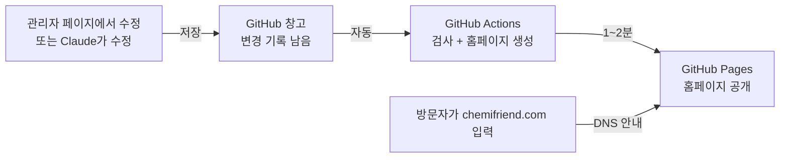

# 케미프렌드 홈페이지 운영 설명서

> 컴퓨터를 잘 몰라도 이 문서만 보고 홈페이지를 관리할 수 있도록 쓴 설명서입니다.
> 처음이라면 **1장(한 장 요약)** 과 **2장(개념)** 을 먼저 읽어 주세요.

- 홈페이지: https://chemifriend.com (도메인 연결 전 임시 주소: https://chemifriend.github.io)
- 영문 홈페이지: https://chemifriend.com/en/ — 해외 바이어 대상 **한국 화학제품 소싱(수출) 안내** 페이지. 제품 스펙표는 한국어 사이트에만 있습니다 (해외 판매권이 없는 제품이 대부분이므로)
- 관리자 페이지: https://chemifriend.com/admin/ (임시: https://chemifriend.github.io/admin/)
- 이 설명서와 홈페이지 파일 보관 장소(GitHub 저장소): https://github.com/Chemifriend/chemifriend.github.io

---

## 1. 한 장 요약

| 하고 싶은 일 | 방법 | 난이도 |
|---|---|---|
| 전화번호·주소·인사말·연혁 수정 | 관리자 페이지 → 해당 메뉴 → 수정 → [변경 확인·반영] | 쉬움 |
| 영문(수출) 사이트 문구 수정 | 관리자 페이지 → **영문 수출 페이지** (첫 화면·서비스·네트워크·문의 메일), 회사정보·연혁의 **(영문)** 칸 | 쉬움 |
| 직원 추가·퇴사 반영 | 관리자 페이지 → 조직도 | 쉬움 |
| 제품 추가·스펙 수정 | 관리자 페이지 → 제품 (화면에서 직접, 또는 엑셀 내려받기→수정→불러오기) | 쉬움 |
| 새 제조사(브랜드) 추가, 로고 교체 | 관리자 페이지 → 제조사 | 쉬움 |
| 디자인 변경, 새 메뉴·페이지 추가, 중국어 사이트 등 | Claude(AI)에게 맡기기 → 4장 | 보통 |
| 잘못 반영해서 되돌리고 싶을 때 | 관리자 페이지 → [버전 기록 · 복구] → 이전 시점으로 되돌리기 | 쉬움 |

**꼭 기억할 것 3가지**
1. 관리자 페이지에서 고친 내용은 **[변경 확인·반영]** 을 눌러야 홈페이지에 올라갑니다. 1~2분 걸립니다.
2. 실수해도 괜찮습니다. 모든 변경은 기록이 남고 **언제든 되돌릴 수 있습니다.**
3. 조직도에 **휴대전화 번호는 절대 넣지 마세요.** 홈페이지 자료는 인터넷에 공개되어 있습니다.

**1년에 한 번 할 일** → 6장 참고 (접속 키 재발급, 도메인 갱신)

---

## 2. 홈페이지는 어떻게 돌아가나 (개념)

### 2-1. 비유로 이해하기

홈페이지를 **가게**에 비유하면 이렇습니다.

| 용어 | 비유 | 케미프렌드의 경우 |
|---|---|---|
| **도메인** | 가게 **주소** (간판에 적힌 이름) | `chemifriend.com` — 닷네임코리아(닷홈)에서 등록, 매년 갱신 |
| **DNS** | 주소를 실제 위치로 안내해 주는 **안내 데스크** | "chemifriend.com 오시면 GitHub 건물로 가세요"라고 적어둔 설정. 닷홈 관리 화면에 있음 |
| **호스팅** | 가게가 들어 있는 **건물** (임대) | 예전: 닷홈 유료 호스팅(연 20~30만원) → 지금: **GitHub Pages (무료)** |
| **홈페이지 파일** | 가게 **진열대와 상품** | GitHub 저장소 안의 파일들 |
| **GitHub** | 파일을 보관하는 **창고** + 모든 변경을 적는 **장부** | `Chemifriend` 계정의 `chemifriend.github.io` 저장소 |
| **GitHub Actions** | 창고에 새 자료가 들어오면 자동으로 진열을 바꿔주는 **자동 공장** | 내용이 바뀔 때마다 1~2분 안에 홈페이지를 다시 만들어 줌 |
| **관리자 페이지** | 직원이 쓰는 **사무실 창구** | 여기서 고치면 창고에 저장되고 → 자동 공장이 홈페이지를 바꿈 |
| **접속 키(토큰)** | 사무실 창구 **출입증** | 관리자 페이지에 처음 한 번 입력. 1년마다 새로 발급 |

### 2-2. 수정하면 무슨 일이 일어나나



- 검사에서 문제가 발견되면(필수 칸이 비었거나 휴대폰 번호가 들어갔거나 등) **홈페이지는 바뀌지 않고 직전 상태 그대로** 유지됩니다. 망가진 홈페이지가 공개되는 일은 없습니다.

### 2-3. 예전과 달라진 점

| | 예전 | 지금 |
|---|---|---|
| 건물(호스팅) | 닷홈 유료 호스팅 + 그누보드 | GitHub Pages **무료** |
| 수정 방법 | 게시판 관리자 | 관리자 페이지 / Claude |
| 비용 | 호스팅비 연 20~30만원 + 도메인 | **도메인 비용만** (연 1회) |
| 잘못 고쳤을 때 | 복구 어려움 | 클릭 한 번으로 이전 시점 복구 |

### 2-4. 파일 구조 (몰라도 됨 — 궁금한 분만)

| 폴더/파일 | 내용 |
|---|---|
| `data/` | **홈페이지 내용** (회사정보, 연혁, 조직도, 제조사, 제품). 관리자 페이지가 고치는 곳 |
| `templates/`, `static/` | 디자인 (화면 틀, 색, 글꼴, 로고) |
| `admin/` | 관리자 페이지 |
| `build.py` | 내용 + 디자인을 합쳐 홈페이지를 만드는 프로그램 |
| `CLAUDE.md` | Claude(AI)가 이 홈페이지를 이해하도록 쓴 메모. 사람은 안 봐도 됨 |
| `운영설명서.md` | 이 문서 |

---

## 3. 수정 방법 A — 관리자 페이지 (대부분 이걸로 충분)

### 3-1. 처음 접속 (이 컴퓨터에서 한 번만)
1. 관리자 페이지 주소를 엽니다.
2. **접속 키(토큰)** 를 붙여넣고 [접속]. 키가 없으면 관리 담당자에게 받거나 6-1장대로 발급합니다.
3. 다음부터는 같은 컴퓨터·같은 브라우저에서 바로 열립니다.

### 3-2. 수정하고 반영하기
1. 왼쪽 메뉴에서 고칠 곳을 고릅니다: **회사정보 / 연혁 / 조직도 / 제조사 / 제품**
2. 칸을 눌러 고칩니다. 고친 칸은 노란색, 새로 추가한 줄은 초록색으로 표시됩니다.
3. 오른쪽 위 **[변경 확인·반영]** → 바뀐 내용 목록을 확인 → **[사이트에 반영]**
4. 위쪽 상태 표시가 "반영 완료"가 되면 홈페이지를 새로고침해서 확인합니다.

- 오류가 있으면 빨간 상자로 이유가 나오고 반영 버튼이 잠깁니다. 알려주는 곳을 고친 뒤 다시 누르세요.
- 반영 전에 다 취소하고 싶으면 **[변경 취소]**.

### 3-3. 제품을 엑셀로 한꺼번에 고치기
1. 제품 → 제조사 → 제품군 선택 → **[⬇ 엑셀로 내려받기]**
2. 엑셀에서 수정합니다.
   - 시트 하나 = 홈페이지의 표 하나
   - 1행은 제목(품명, Application, 스펙 항목…). 열 추가·이름 변경 가능
   - 맨 오른쪽 **ID(수정금지)** 열은 그대로 두세요. 새 제품 줄은 비워두면 됩니다
3. 저장 → **[⬆ 엑셀 불러오기]** → 미리보기에서 **추가 / 변경 / 그대로 / 엑셀에 없는 제품** 숫자 확인 → [적용]
   - 엑셀에서 줄을 지웠어도 바로 삭제되지 않습니다. 미리보기에서 "삭제"에 체크해야만 지워집니다.
4. 오른쪽 위 **[변경 확인·반영]** 으로 홈페이지에 반영.

### 3-4. 자주 하는 작업
| 작업 | 위치 |
|---|---|
| 대표전화·주소 변경 | 회사정보 |
| 문의 폼 받는 메일 변경 | 6-3장 (Web3Forms 키 교체) |
| 직원 입사 | 조직도 → 해당 부서 [+ 직원 추가] (이메일은 공개할 사람만) |
| 직원 퇴사 | 조직도 → ✕. 제조사 문의 담당이면 먼저 제조사 화면에서 담당자를 바꿔야 삭제됨 |
| 브랜드 담당자 변경 | 제조사 → 해당 제조사 → 문의 담당 |
| 제조사 취급 중단 | 제조사 → [홈페이지에 표시] 끄기 (자료는 보관됨, 다시 켜면 복구) |
| 로고 교체 | 제조사 → 로고 칸에 이미지 끌어놓기 (흰 여백 자동 정리) |
| 전체 백업 | 홈 → [⬇ 전체 백업 (엑셀)] — 분기마다 한 번 받아두기 권장 |
| 영문(수출) 사이트 | **영문 수출 페이지** 메뉴 + 회사정보·연혁의 **(영문)** 칸. 영문 칸을 비워두면 영문 사이트에 한국어가 그대로 나옴 |

> 영문 사이트의 파트너사 로고·제품군 이름은 제조사·제품 화면의 내용이 자동으로 쓰입니다.

### 3-5. 잘못 반영했을 때
관리자 페이지 → **[버전 기록 · 복구]** → 문제 생기기 전 시점의 **[이 시점으로 되돌리기]**.
되돌리기도 기록에 남기 때문에, 되돌린 것을 다시 되돌릴 수도 있습니다.

---

## 4. 수정 방법 B — Claude(AI)에게 맡기기

관리자 페이지로 안 되는 일(디자인 변경, 새 메뉴·페이지, 기능 추가 등)은 **Claude**에게 말로 부탁하면 됩니다. 프로그램 설치는 필요 없고 **웹 브라우저만** 있으면 됩니다.

### 4-1. 준비 (처음 한 번)
1. https://claude.ai 에서 계정 만들기 (회사 메일 권장)
2. **Pro 요금제** 구독 (필요한 달만 구독하고 끝나면 해지해도 됨)
3. https://claude.ai/code 접속 → **GitHub 연결** 안내가 나오면 따라 하기
   - GitHub 로그인은 회사 계정 **Chemifriend** 로
   - "Authorize(승인)" 버튼 누르기
4. 입력창 아래 **저장소 선택**에서 `Chemifriend/chemifriend.github.io` 선택

### 4-2. 부탁하기
입력창에 하고 싶은 일을 평소 말투로 적습니다. Claude는 저장소의 `CLAUDE.md`를 자동으로 읽기 때문에 홈페이지 구조·규칙을 이미 알고 시작합니다.

**첫 부탁 예시 (그대로 복사해서 써도 됨)**
```
나는 컴퓨터를 잘 모르는 케미프렌드 홈페이지 담당자야.
CLAUDE.md를 먼저 읽고, 아래 작업을 해줘. 설명은 쉽게 해주고,
끝나면 내가 GitHub에서 무엇을 눌러야 홈페이지에 반영되는지 순서대로 알려줘.

작업: (예) 메인 페이지 연혁 부분 글씨를 조금 더 크게 해줘
```

**다른 부탁 예시**
- "Contact 페이지에 오시는 길 안내 문구(지하철역 기준)를 추가해줘"
- "영문 수출 페이지에 보유 인증서(ISO 등) 소개 섹션을 추가해줘"
- "관리자 페이지에서 연혁을 엑셀로도 올릴 수 있게 해줘"

### 4-3. 결과를 홈페이지에 반영하기
Claude는 작업을 **따로 보관함(브랜치)** 에 저장합니다. 확인 후 합쳐야 홈페이지에 반영됩니다.
1. Claude 화면에서 바뀐 내용을 확인 → **[Create PR]** (변경 요청서 만들기)
2. GitHub 페이지가 열리면 초록 버튼 **[Merge pull request]** → **[Confirm merge]**
3. 1~2분 뒤 홈페이지 반영. 저장소의 **Actions** 탭에 초록 체크(✓)가 뜨면 완료

> 잘 모르겠으면 Claude에게 "지금 화면에서 뭘 눌러야 해?"라고 물어보세요.
> 반영 후 문제가 생기면 3-5장(버전 복구) 또는 Claude에게 "방금 변경을 되돌려줘"라고 부탁하세요.

### 4-4. 주의
- 내용(전화번호, 제품, 직원 등)만 바꾸는 일은 **관리자 페이지가 더 빠르고 안전**합니다.
- 비밀번호, 접속 키(토큰)는 Claude에게 알려주지 마세요. 필요 없습니다.
- 구독이 필요 없어지면 claude.ai → 설정 → 구독에서 해지하세요.

---

## 5. 문제가 생겼을 때

| 증상 | 원인 | 해결 |
|---|---|---|
| 관리자 페이지에서 "토큰이 만료" | 접속 키 1년 기한 끝남 | 6-1장대로 새 키 발급 후 입력 |
| 반영했는데 홈페이지가 안 바뀜 | 1~2분 대기 필요, 또는 검사 실패 | 3분 뒤 새로고침. 관리자 페이지 위쪽이 빨간색 "반영 실패"면 눌러서 원인 확인 → 고쳐서 다시 반영하거나 버전 복구 |
| 내용이 이상하게 바뀜 | 잘못 입력 | 버전 기록 · 복구 (3-5장) |
| chemifriend.com이 아예 안 열림 / 다른 회사 화면이 뜸 | 도메인 기한 만료 또는 DNS 설정 변경됨 | 6-2장: 닷홈에서 도메인 기한·DNS 확인 |
| "다른 곳에서 먼저 수정했습니다" | 두 사람이 동시에 수정 | 새로고침 후 다시 수정 |
| 그 밖의 모든 문제 | — | Claude(4장)에게 증상과 화면 문구를 그대로 붙여넣고 물어보기 |

---

## 6. 정기적으로 할 일

### 6-1. 접속 키(토큰) 재발급 — 1년마다
1. GitHub에 **Chemifriend** 계정으로 로그인
2. https://github.com/settings/personal-access-tokens/new 열기
3. 다음과 같이 입력
   - Token name: `홈페이지관리-이름`
   - Expiration: 가장 긴 기간(1년)
   - Repository access: **Only select repositories** → `chemifriend.github.io`
   - Permissions: **Contents → Read and write**, **Actions → Read-only**
4. [Generate token] → `github_pat_…` 값 복사 (한 번만 보임)
5. 관리자 페이지 → 로그아웃 → 새 키 입력
6. 다 쓴 옛 키는 https://github.com/settings/personal-access-tokens 에서 삭제

> 담당자가 바뀌거나 PC를 반납할 때도: 관리자 페이지 로그아웃 + GitHub에서 그 사람의 키 삭제.

### 6-2. 도메인 갱신 — 매년 7월
- `chemifriend.com` 은 **닷네임코리아(닷홈과 같은 회사)** 에 등록되어 있습니다. 만료일 **매년 7월 12일** (현재 2027-07-12까지)
- 만료 전에 닷홈(https://www.dothome.co.kr) 로그인 → 도메인 관리 → 기간 연장
- **도메인을 놓치면 홈페이지 주소를 잃습니다.** 가장 중요한 연례 업무입니다.

### 6-3. 홈페이지 문의 폼 연결 (최초 1회, 담당 메일이 바뀔 때)
홈페이지의 문의 폼(한국어 Contact, 영문 견적 요청)은 **Web3Forms**라는 무료 서비스를 통해 메일로 전달됩니다. (무료: 월 250건)
1. https://web3forms.com 접속 → 문의를 받을 **회사 공용 메일**로 가입 (개인 메일 X)
2. 발급된 **Access Key**(xxxxxxxx-xxxx-… 형태) 복사
3. 관리자 페이지 → 회사정보 → **문의 폼 키** 칸에 붙여넣기 → [변경 확인·반영]
4. 홈페이지에서 시험 문의를 한 번 보내 메일이 오는지 확인

- 키가 비어 있거나 서비스에 문제가 생기면, 폼이 **작성 내용을 채운 메일 창**을 열어 주기 때문에 문의가 사라지지 않습니다.
- 받는 메일 주소를 바꾸려면 Web3Forms에서 새 메일로 키를 다시 만들고 3번을 반복합니다.
- 스팸: 숨은 함정 칸과 제출 시간 검사로 자동 스팸을 걸러냅니다. 그래도 많아지면 Claude에게 "문의 폼에 캡차를 추가해줘"라고 부탁하세요.

### 6-4. 계정 점검 — 1년에 한 번
- GitHub `Chemifriend` 계정에 로그인이 되는지, 2단계 인증 기기가 누구에게 있는지 확인
- 분기마다 관리자 페이지 [전체 백업 (엑셀)] 받아서 공유폴더에 보관

---

## 7. 계정·자산 목록

> **비밀번호는 이 문서에 적지 마세요.** 이 문서는 인터넷에 공개되어 있습니다. "어디에 보관돼 있는지"만 회사 내부 문서에 적어두세요.

| 항목 | 내용 | 비밀번호·키 보관 위치 (회사 내부 문서에 기록) |
|---|---|---|
| GitHub 계정 | 아이디 `Chemifriend` | 로그인 정보, 2단계 인증 복구 코드 |
| 홈페이지 저장소 | `Chemifriend/chemifriend.github.io` (공개) | — |
| 도메인 | `chemifriend.com` / 등록: 닷네임코리아(닷홈) / 만료 매년 7월 12일 | 닷홈 계정 |
| DNS 설정 | 닷홈 네임서버 사용 (ns1~3.dothome.co.kr) | 닷홈 계정 |
| 관리자 페이지 접속 키 | 1년 기한, 담당자별 발급 | 각자 브라우저에만 저장 (문서에 적지 않음) |
| Web3Forms (문의 폼) | 회사 공용 메일로 가입, 월 250건 무료 | 공용 메일 계정 |
| Claude 계정 (선택) | 필요할 때만 Pro 구독 | 담당자 개인 |
| 옛 호스팅 | 닷홈 웹호스팅 (그누보드) — 새 홈페이지로 옮긴 뒤 해지 | 닷홈 계정 |

**계정 인수인계 원칙**
- GitHub 계정의 가입 이메일은 개인 메일이 아닌 **회사 공용 메일**이어야 합니다 (퇴사하면 복구 불가).
- 2단계 인증 **복구 코드**는 회사에 보관합니다.

---

## 8. 부록 — 도메인을 새 홈페이지에 연결하는 방법 (최초 1회)

> 이미 연결되어 있다면 할 필요 없습니다. 주소 연결이 끊겼을 때 다시 설정하는 방법이기도 합니다.

**① GitHub 쪽**
1. 저장소 → Settings → Pages
2. Custom domain 칸에 `chemifriend.com` 입력 → Save

**② 닷홈 쪽 (DNS 설정)**
1. 닷홈 로그인 → 도메인 관리 → `chemifriend.com` → DNS(레코드) 관리
2. 기존 `A` 레코드(옛 호스팅 주소)를 지우고 아래 5개를 추가
3. 저장 후 몇 분~몇 시간 기다리기

| 종류 | 호스트 | 값 |
|---|---|---|
| A | @ (비워둠) | 185.199.108.153 |
| A | @ | 185.199.109.153 |
| A | @ | 185.199.110.153 |
| A | @ | 185.199.111.153 |
| CNAME | www | chemifriend.github.io |

**③ 확인**
1. chemifriend.com 에 새 홈페이지가 뜨면 성공
2. GitHub 저장소 → Settings → Pages → **Enforce HTTPS** 체크 (자물쇠 표시 주소)
3. 새 홈페이지가 잘 뜨는 것을 확인한 **다음에** 옛 호스팅(닷홈 웹호스팅)을 해지. 도메인은 해지하면 안 됨!
4. 구글 검색 등록: https://search.google.com/search-console 에서 사이트 등록 → `sitemap.xml` 제출

---

## 9. 용어 사전

| 용어 | 뜻 |
|---|---|
| 반영 / 배포 | 고친 내용을 실제 홈페이지에 올리는 것 |
| 커밋(commit) | GitHub 창고에 변경을 한 건 저장하는 것. 기록이 남음 |
| 브랜치(branch) | 본 창고와 별도로 작업하는 임시 보관함 |
| PR (Pull Request) | 임시 보관함의 변경을 본 창고에 합쳐 달라는 요청서 |
| Merge | PR을 승인해서 본 창고에 합치는 것 |
| Actions | 변경이 들어오면 자동으로 검사하고 홈페이지를 만드는 GitHub의 자동 작업 |
| 토큰 | 관리자 페이지 출입증 (비밀번호 같은 것) |
| DNS | 도메인(주소)을 실제 서버로 연결해 주는 설정 |
| 호스팅 | 홈페이지 파일을 올려두는 서버를 빌려 쓰는 것 |
